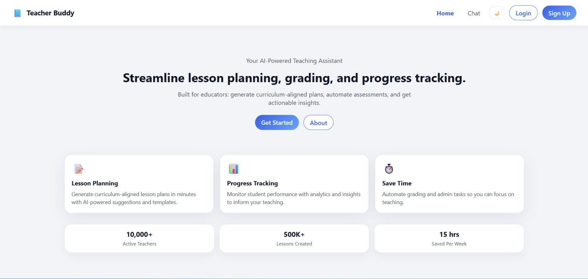
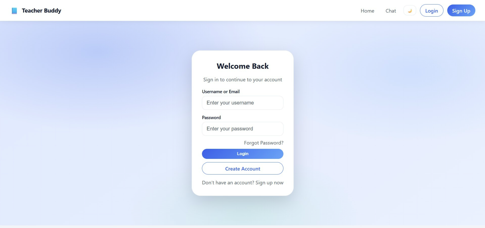
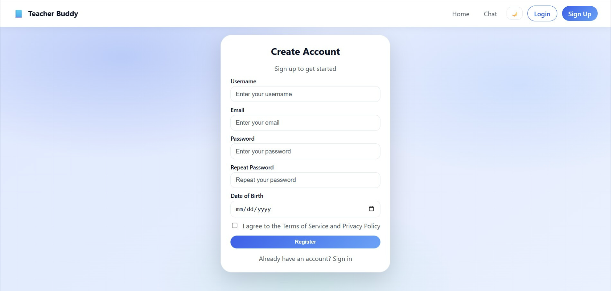
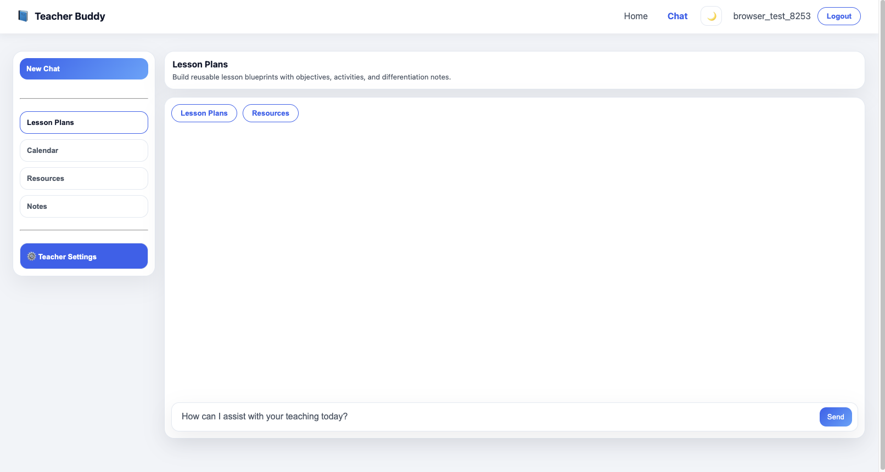
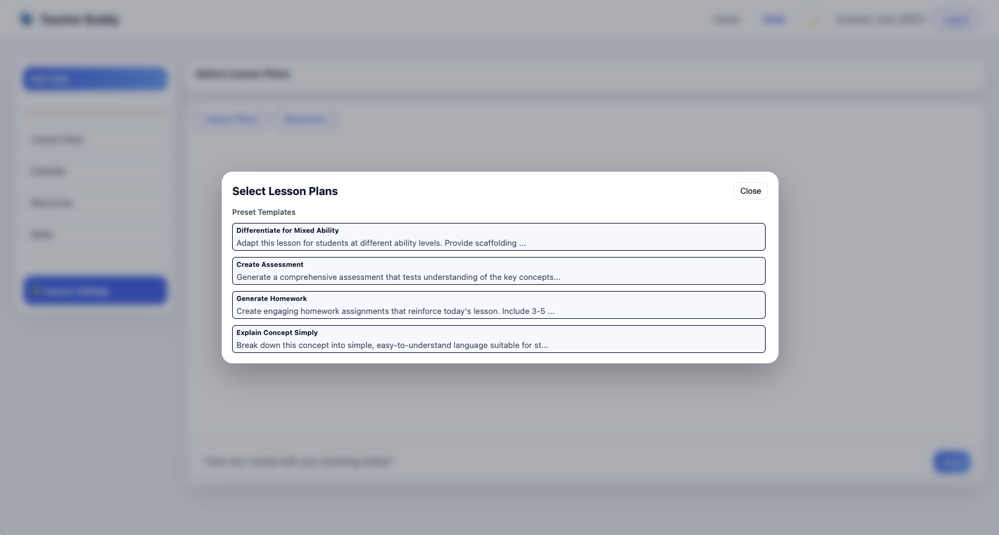
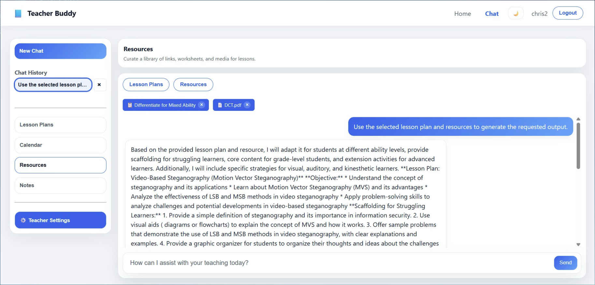
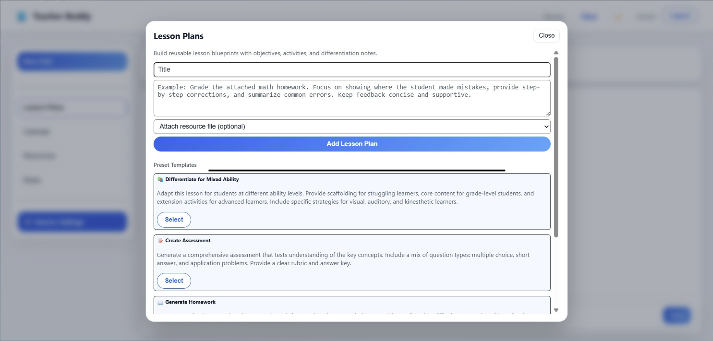
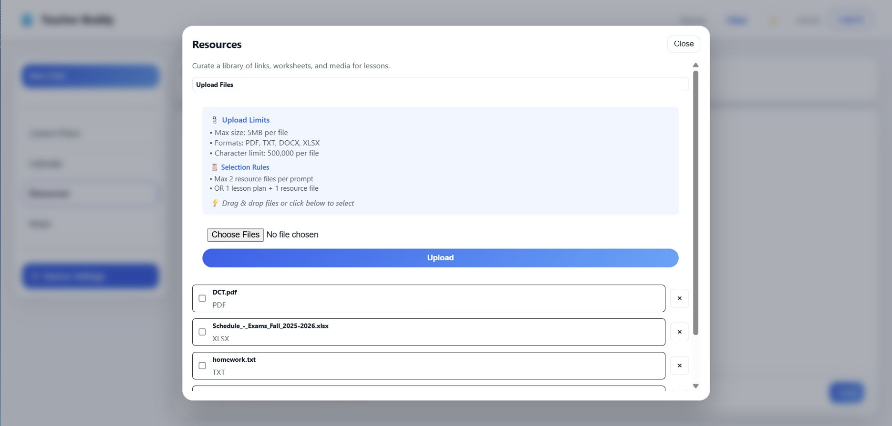
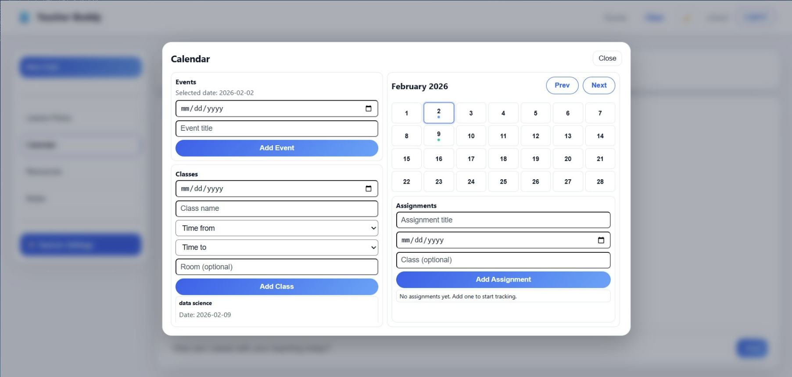
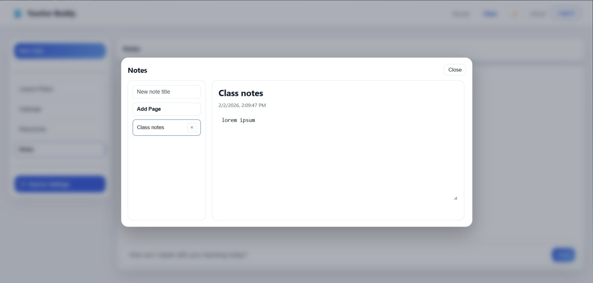

<p align="center">
  
</p>

<h1 align="center">Teacher Buddy</h1>

<p align="center">
  <strong>Your AI-Powered Teaching Assistant</strong><br>
  Streamline lesson planning, grading, and progress tracking — all in one place.
</p>

<p align="center">
  <a href="#features">Features</a> &bull;
  <a href="#screenshots">Screenshots</a> &bull;
  <a href="#quick-start">Quick Start</a> &bull;
  <a href="#architecture">Architecture</a> &bull;
  <a href="#api-endpoints">API</a> &bull;
  <a href="#documentation">Docs</a> &bull;
  <a href="#license">License</a>
</p>

---

## About

Teacher Buddy is a full-stack web application that brings AI support and classroom organization into one unified workspace. Built for educators, it helps generate curriculum-aligned lesson plans, chat with an AI assistant, manage resources, take notes, track calendar events, and handle assignments — replacing the need to juggle multiple tools.

By combining intelligent content generation with practical teaching utilities, Teacher Buddy lets educators prepare faster, stay organized, and spend more time on what matters most: their students.

---

## Features

| Feature | Description |
|---|---|
| **AI Chat Assistant** | Converse with an AI teaching assistant powered by Llama 3 via Ollama. Ask questions, brainstorm ideas, or get instant help with any teaching topic. |
| **Lesson Plan Builder** | Create reusable lesson blueprints with objectives, activities, and differentiation notes. Choose from preset templates like "Differentiate for Mixed Ability", "Create Assessment", or "Generate Homework". |
| **Resource Library** | Upload and organize teaching materials (PDF, DOCX, XLSX, TXT). Attach resources to lesson plans and reference them directly in chat for AI-enhanced content generation. |
| **Calendar & Scheduling** | Manage events, classes, and assignments with an interactive monthly calendar. Keep track of important dates and deadlines at a glance. |
| **Notes** | A built-in notebook for quick class notes, meeting summaries, or daily reflections — organized by pages. |
| **Dark / Light Theme** | Toggle between dark and light mode for comfortable use at any time of day. |
| **Role-Based Access** | JWT-authenticated login system with admin capabilities and user-level access control. |

---

## Screenshots

### Authentication

<p align="center">
  
  &nbsp;&nbsp;
  
</p>
<p align="center"><em>Login & Account Registration</em></p>

### AI Chat Workspace

<p align="center">
  
</p>
<p align="center"><em>The productivity dashboard — chat with AI, access lesson plans, calendar, resources, and notes from the sidebar.</em></p>

<p align="center">
  
  &nbsp;&nbsp;
  
</p>
<p align="center"><em>Preset templates for common tasks (left) and an active chat session with resource context (right).</em></p>

### Lesson Plans

<p align="center">
  
</p>
<p align="center"><em>Build lesson blueprints with templates, attach resources, and generate content with AI.</em></p>

### Resource Library

<p align="center">
  
</p>
<p align="center"><em>Upload and manage teaching materials — supports PDF, DOCX, XLSX, and TXT files.</em></p>

### Calendar

<p align="center">
  
</p>
<p align="center"><em>Track events, schedule classes, and manage assignments with an interactive calendar.</em></p>

### Notes

<p align="center">
  
</p>
<p align="center"><em>Organize class notes, meeting summaries, and reflections by pages.</em></p>

---

## Tech Stack

| Layer | Technology |
|---|---|
| **Frontend** | React 18, TypeScript, Vite, React Router, Axios |
| **Backend** | Flask 3, SQLAlchemy 2, Flask-JWT-Extended |
| **Database** | PostgreSQL 16 |
| **AI Engine** | Ollama + Llama 3 (runs locally) |
| **Infrastructure** | Docker & Docker Compose |
| **Security** | JWT authentication, PBKDF2 password hashing |

---

## Architecture

```
Browser (5173)  -->  Flask API (5000)  -->  PostgreSQL (5432)
                          |
                          v
                     Ollama (12434)  -->  Llama 3
```

---

## Quick Start

### Prerequisites

- **Docker Desktop** (for backend services)
- **Node.js 18+** (for the frontend)

### 1. Start backend services

```bash
cd backend
docker volume create ollama        # first time only
docker volume create postgres_data # first time only
docker-compose up -d --build
```

### 2. Pull the AI model (first run only)

```bash
docker exec -it ollama ollama pull llama3
```

> This downloads Llama 3 (~4.7 GB) and may take 5-15 minutes.

### 3. Start the frontend

```bash
cd frontend
npm install   # first time only
npm run dev
```

### 4. Open the app

Open your browser and navigate to **http://localhost:5173**

**Default admin credentials:**
| Field | Value |
|---|---|
| Username | `admin` |
| Password | `admin123` |

---

## Services & Ports

| Service | Port |
|---|---|
| Frontend (Vite) | `5173` |
| API (Flask) | `5000` |
| PostgreSQL | `5432` |
| Ollama | `12434` |

---

## API Endpoints

<details>
<summary><strong>Authentication</strong></summary>

| Method | Endpoint | Description |
|---|---|---|
| `POST` | `/api/auth/register` | Register a new user |
| `POST` | `/api/auth/login` | Log in and receive a JWT |
| `GET` | `/api/auth/verify` | Verify current token |

</details>

<details>
<summary><strong>Chat</strong> (requires auth)</summary>

| Method | Endpoint | Description |
|---|---|---|
| `GET` | `/api/chat/sessions` | List all chat sessions |
| `GET` | `/api/chat/sessions/:id` | Get a specific session |
| `POST` | `/api/chat/send` | Send a message to the AI |
| `DELETE` | `/api/chat/sessions/:id` | Delete a session |

</details>

<details>
<summary><strong>Lesson Plans</strong> (requires auth)</summary>

| Method | Endpoint | Description |
|---|---|---|
| `GET` | `/api/lesson-plans` | List all lesson plans |
| `POST` | `/api/lesson-plans` | Create a lesson plan |
| `DELETE` | `/api/lesson-plans/:id` | Delete a lesson plan |

</details>

<details>
<summary><strong>Resources</strong> (requires auth)</summary>

| Method | Endpoint | Description |
|---|---|---|
| `GET` | `/api/resources` | List all resources |
| `POST` | `/api/resources/upload` | Upload a resource file |
| `DELETE` | `/api/resources/:id` | Delete a resource |

</details>

<details>
<summary><strong>Calendar</strong> (requires auth)</summary>

| Method | Endpoint | Description |
|---|---|---|
| `GET` | `/api/calendar/events` | List events |
| `POST` | `/api/calendar/events` | Create an event |
| `DELETE` | `/api/calendar/events/:id` | Delete an event |
| `GET` | `/api/calendar/classes` | List classes |
| `POST` | `/api/calendar/classes` | Create a class |
| `DELETE` | `/api/calendar/classes/:id` | Delete a class |

</details>

<details>
<summary><strong>Notes, Assignments, Preferences & Admin</strong> (requires auth)</summary>

| Method | Endpoint | Description |
|---|---|---|
| `GET` | `/api/notes` | List notes |
| `POST` | `/api/notes` | Create a note |
| `DELETE` | `/api/notes/:id` | Delete a note |
| `GET` | `/api/assignments` | List assignments |
| `POST` | `/api/assignments` | Create an assignment |
| `DELETE` | `/api/assignments/:id` | Delete an assignment |
| `GET` | `/api/preferences` | Get user preferences |
| `PUT` | `/api/preferences` | Update preferences |
| `GET` | `/api/admin/stats` | Admin dashboard stats |
| `GET` | `/api/health` | Health check |

</details>

---

## Documentation

| Document | Description |
|---|---|
| [QUICKSTART.md](QUICKSTART.md) | Step-by-step setup guide with common commands and quick fixes |
| [TECH_STACK.md](TECH_STACK.md) | Detailed breakdown of all technologies and libraries used |
| [DATABASE_SCHEMA.md](DATABASE_SCHEMA.md) | Complete database schema with tables and columns |
| [TROUBLESHOOTING.md](TROUBLESHOOTING.md) | Solutions for common setup and runtime issues |

---

## Navigation Flow

```
Landing Page  -->  Login / Register / About
                        |
                        v
               Productivity Dashboard
              (Chat, Lesson Plans, Calendar,
               Resources, Notes, Settings)
                        |
                        v
                 Admin Panel (admin only)
```

---

## License

This project is licensed under the **MIT License** — see the [LICENSE](LICENSE) file for details.

Copyright (c) 2025 Athens Tech College
